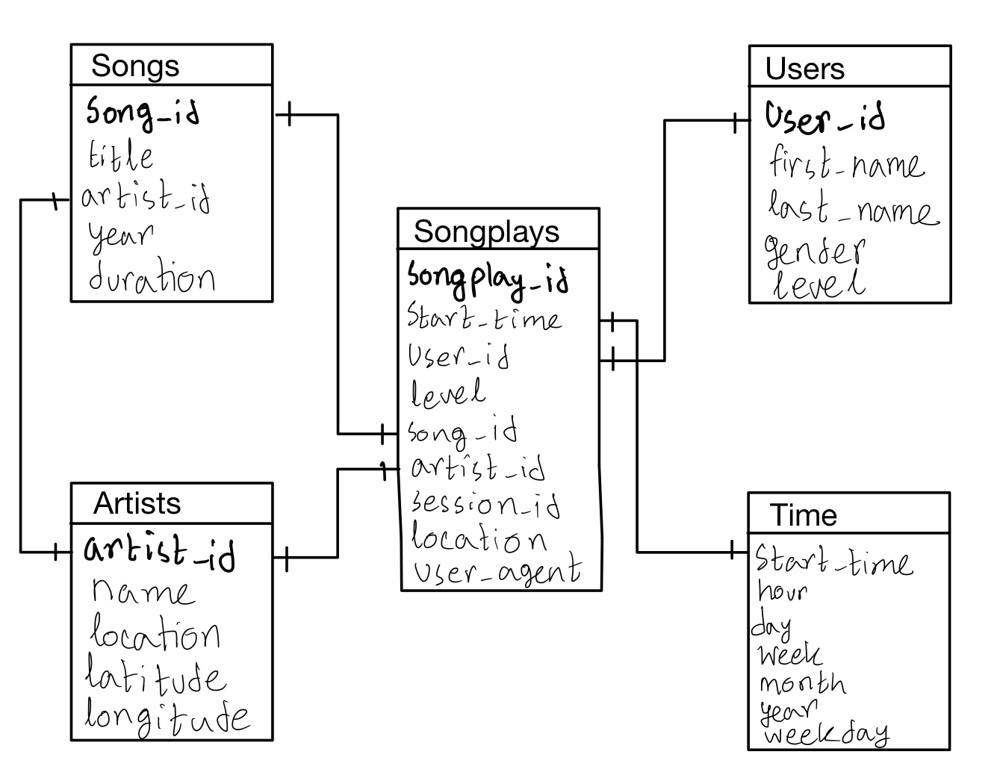

## Sparkify Music Streaming App

Sparkify is a startup company that launched a new music streaming app. They want to know what songs users are litening to but they don't have an easy way to query the data which is stored as JSON logs of user activity and song metadata. To optimize their queries on song play analysis, we created a Postgresql database and an ETL pipeline to analyze the data.

### The Database
We created a database called "sparkifydb" hosted locally using postgres. This database contains 5 tables - users, songs, artists, time and songplays. We have several dimension tables to work with and queries often require JOINs and aggregations. Thus to reduce the number of JOINs and to make the data more easily quried, we chose to denormalize the tables. This way reads will be faster.

Given the facts that we don't need one-to-many relationships, have denormalized tables, need fast aggregations and fast reads, we chose to use a star schema. The entity relationship diagram is as follows-



The *songplays* table is fact table and the rest are dimension tables.

### The ETL Pipeline
The pipeline starts by reading in the input datasets - 
1. JSON log of user activity
2. JSON metadata of songs

We convert the input data to pandas dataframes, as transform them as necessary (units, data type, quantity etc). Then we create the dimension tables one by one in our postgresql database using python. Finally, using the dimension tables, we create the fact table, *songplays*.

#### Sample Queries
The *songplays* is optimized for the *songselect* query -

```sql
SELECT songs.song_id, songs.artist_id 
    FROM songs JOIN artists 
        ON songs.artist_id = artists.artist_id
    WHERE songs.title = %s AND
        artists.name = %s AND
        songs.duration = %s;
```

### List of Files
There are 6 important files in this repository that are essential for running and understanding the database. In no particular order, these are - 
1. `sql_queries.py` all the SQL queries in psql and python  
2. `create_tables.py` dropping and creating all the necessary tables using *sql_queries.py*
3. `etl.ipynb` The ETL pipeline that loads and transforms data and populates tables
4. `etl.py` Same as *etl.ipynb* but automated and precesses entire dataset
5. `test.ipynb` testing queries and pipeline issues
6. `README.md` Documentation for the database

The files listed above all need to be in the same directory in order to run the pipeline without any errors.

### How To Run
First, locally host a postgres database called *studentdb*. In your postgres or psql terminal, execute the following commands -

```
psql postgres -U student
postgres=> CREATE DATABASE studentdb;
postgres=> GRANT ALL PRIVILEGES ON DATABASE studentdb TO student;
postgres=> \connect studentdb
```

Next, create tables using the *create_tables.py* file. Make sure that line 12 in this file has the correct database name, username and password. By default, it is *studentdb*, *student* and *student* respectively.

```
python create_tables.py
```

Finally, run the etl pipeline from the terminal using -

```
python etl.py
```

If you want to go through the pipeline step by step, run the cells in the *etl.ipynb* jupyter notebook.


